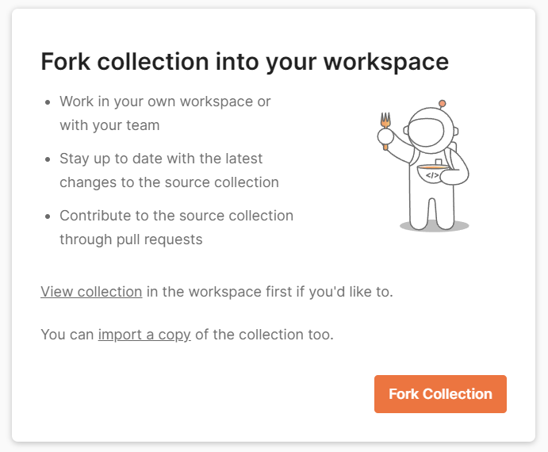
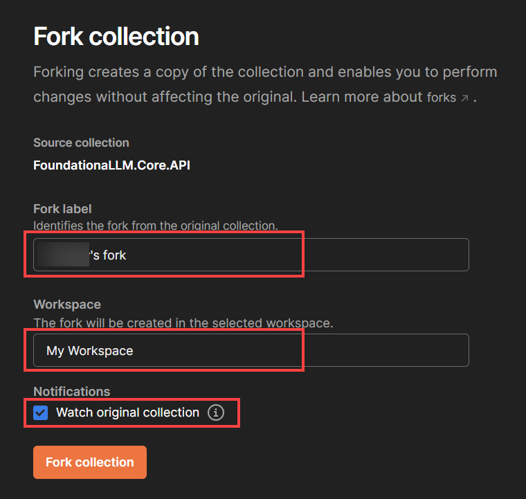
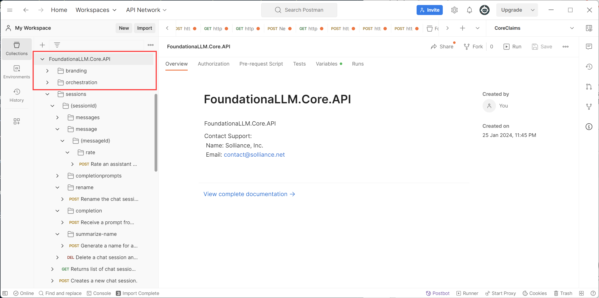
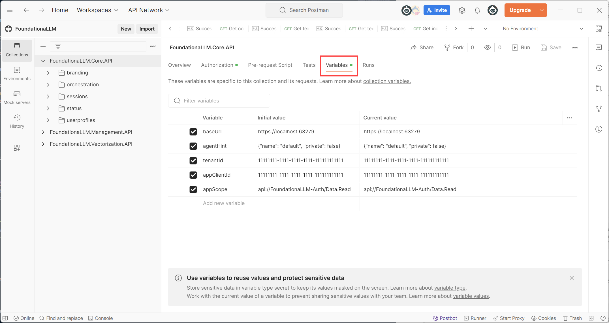
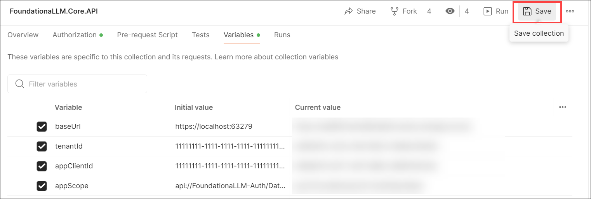
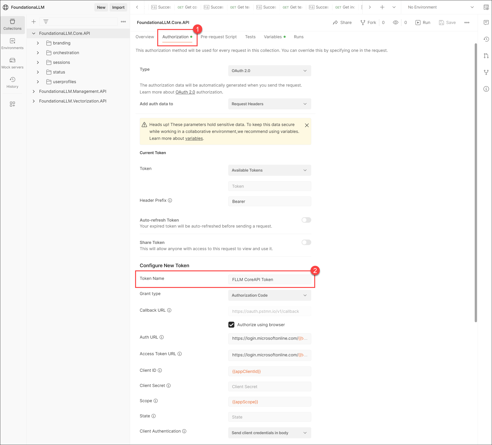
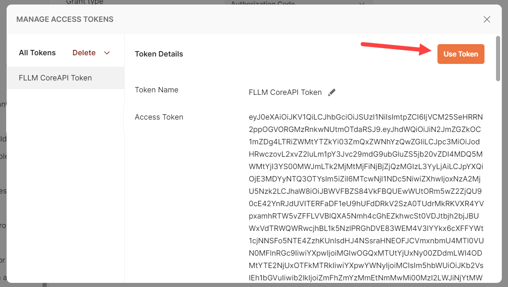
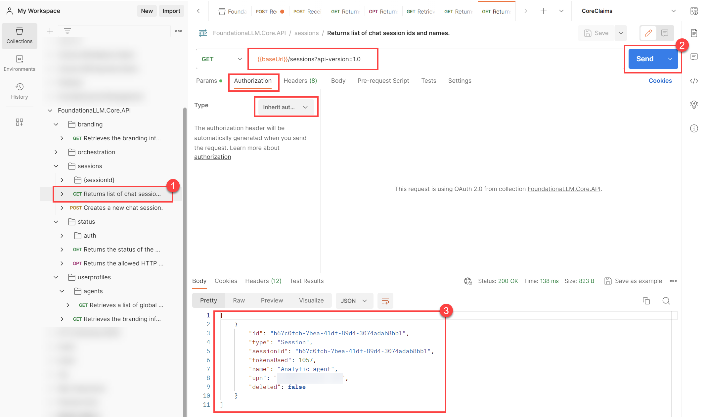
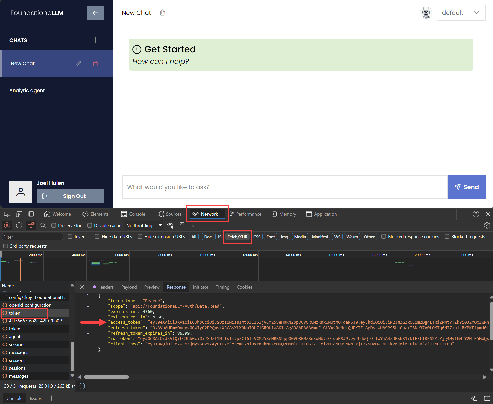
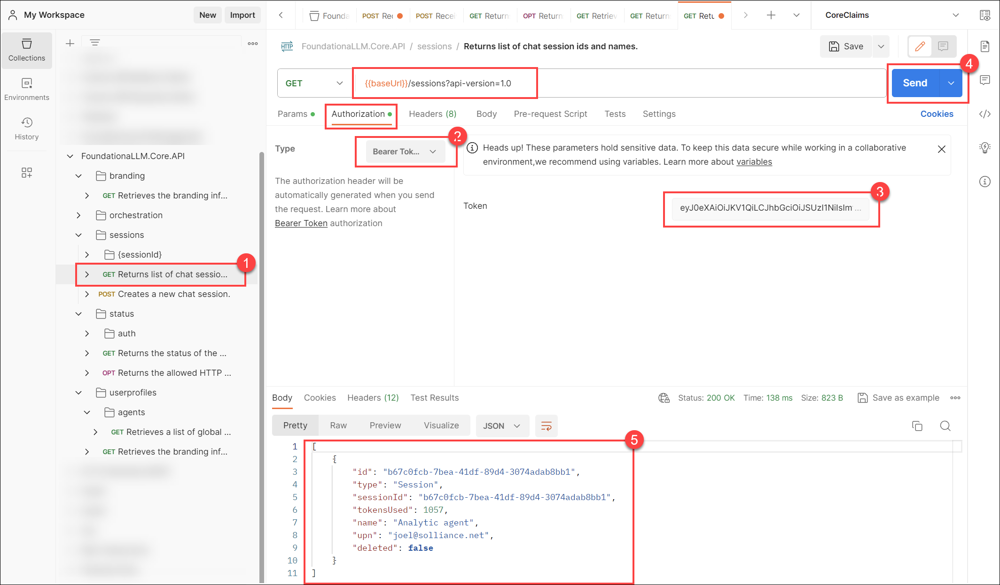

# Directly calling the Core API

Typically, the only interaction with the Foundationa**LLM** (FLLM) APIs is indirectly through the User Portal and Management Portal. However, you can also call the APIs directly to perform certain tasks, such as using your [configured FLLM agents](../../setup-guides/agents/index.md) to perform completions (via the Core API), or updating your branding configurations (via the Management API).

## API architecture

The FLLM architecture contains layers of APIs that are used to perform different tasks along a call chain, starting with the **Core API**. The following diagram shows a very high-level flow of the API architecture:

```mermaid
sequenceDiagram
    actor U as Caller
    participant C as CoreAPI
    participant A as AgentFactoryAPI
    participant O as OrchestrationWrapperAPI

    U->>C: Calls Orchestration endpoint
    C->>A: Calls Orchestration endpoint
    Note over A,O: Agent resolution from cache or hubs
    A->>+O: Invokes orchestrator
    Note over O: Calls LangChain or Semantic Kernel
    O->>-A: Returns result
    A->>C: Returns result
    C->>U: Returns result

```

> [!NOTE]
> The AgentFactoryAPI contains a caching layer for the full agent metadata, including the agent, its datasource(s), and prompts. This caching layer is used to improve performance by reducing the number of calls to the underlying hubs. The AgentFactoryAPI also includes endpoints to clear the cache across different categories. In the more detailed diagram below, you can see that the AgentFactoryAPI calls the AgentHubAPI, PromptHubAPI, and DataSourceHubAPI to retrieve the agent metadata.

When we look a level deeper, we see that there are several interactions between the APIs that occur during the call chain. The following diagram shows a more detailed flow of the API architecture:

```mermaid
graph TD;
    A[CoreAPI] -->|1. User Request| B[GatekeeperAPI] -->|Gatekeeper Extensions| BB[GatekeeperIntegrationAPI]
    A -...->|"1a. User Request (Bypass Gatekeeper)"| C[AgentFactoryAPI]
    B ---->|2. Processed Request| C[AgentFactoryAPI]
    C -->|3. Request| E[(AgentHubAPI)]
    C --->|4. Instantiate Agent| D[[Agent]]
    D -->|Request| F[(PromptHubAPI)]
    D -->|Request| G[(DataSourceHubAPI)]
    E -->|Metadata| C
    F -->|Metadata| D
    G -->|Metadata| D
    D -->|Hydrated Agent| C
    D -->|5. Composed Information| H[OrchestrationWrapperAPI]
    H -->|6. Response| D
    C -->|7. Response| B
    C -...->|"7a. Response (Bypass Gatekeeper)"| A
    B -->|8. Final Response| A

```

> [!NOTE]
> Notice that there is an alternate path that bypasses the Gatekeeper API. This path is used when the `FoundationaLLM:APIs:CoreAPI:BypassGatekeeper` configuration value is set to `true`. By default, the Core API bypasses the Gatekeeper API. To override this behavior and enable the Gatekeeper API, set this value to true. Bypassing the Gatekeeper means that you bypass content protection and filtering in favor of improved performance.

## Postman collection

The ability to test the API endpoints of FoundationaLLM is a critical part of the development process. Postman is a tool that allows you to do just that. This document will walk you through the process of setting up Postman to work with FoundationaLLM.

> [!TIP]
> To find the Core API URL for your deployment, you can retrieve it from your App Configuration resource in the portal by viewing the `FoundationaLLM:APIs:CoreAPI:APIUrl` configuration value. Alternatively, follow the instructions in the [Quickstart guide](../../setup-guides/quickstart.md#find-your-core-api-url) to find the Core API URL.

To see the API endpoints available in FoundationaLLM, you can get your Core API endpoint from your App Configuration resource in the portal and add `/swagger/` to the end of it. For example, if your Core API endpoint is `https://fllmaca002coreca.graybush-c554b849.eastus.azurecontainerapps.io`, then you would navigate to `https://fllmaca002coreca.graybush-c554b849.eastus.azurecontainerapps.io/swagger/` to see the API endpoints.

> [!NOTE]
> The example link above is for a [Quick Start deployment](../../deployment/deployment-quick-start.md) of FoundationaLLM, which deploys the APIs to Azure Container Apps (ACA). If you are using the standard deployment that deploys the APIs to Azure Kubernetes Service (AKS), then you cannot currently access the Swagger UI for the APIs. However, you will be able to obtain the OpenAPI swagger.json file from the Core API endpoint by navigating to `https://{{AKS URL}}/core/swagger/v1/swagger.json`.

### Install Postman

If you don't have Postman installed on your machine, visit the [Postman website](https://www.getpostman.com/) and download the app. Once you have it installed, Create a Blank Workspace.

### Import the Postman collection

1. First, select the button below to fork and import the Postman collection for the Core API.

    

2. Select **Fork Collection** to create a fork and import the collection into your Postman workspace.

    

3. Within the dialog that displays, enter your fork label, select the Postman workspace into which you want to create the fork, optionally check the *Watch original collection* checkbox to receive updates to the original collection, and then select **Fork collection**.

    

You will now see the **FoundationaLLM.Core.API** collection in your Postman workspace.

### Set up the Postman environment variables

The Postman collection you imported contains a number of API endpoints that you can use to test the Core API. However, before you can use these endpoints, you need to set up a Postman environment variables within your collection that contains the Core API URL, agent hint value, and other variables. We will set up your authentication token in the next section.

1. Select the **FoundationaLLM.Core.API** collection in the left-hand menu.

2. Select the **Variables** tab.

    

    > [!TIP]
    > The <https://localhost:63279> value is the default value for the Core API URL (`baseUrl` variable) when debugging it locally. You can leave this value as-is if you are testing locally, or you can replace it with the Core API URL for your deployment.

    > [!NOTE]
    > The `Initial value` column is the value that will be used when you first import the collection. The `Current value` column is the value that will be used when you run the collection. If you change the `Current value` column, the `Initial value` column will not be updated. For the steps that follow, you will be updating the `Current value` column.

3. Update the `baseUrl` variable `Current value` with the Core API URL for your deployment.

    

4. Fill out the `tenantId`, `appClientId`, and `appScope` **Current value** settings for your **Core Client** Entra ID app registration ([setup instructions](../../deployment/authentication/core-authentication-setup-entra.md#register-the-client-application-in-the-microsoft-entra-id-admin-center)). Use the list below the screenshot to find the values.

    

    - **tenantId**: The tenant ID of your Core Client (Chat UI) Entra ID app. You can find this value in the **Overview** tab of your Entra ID app in the portal.
    - **appClientId**: The client ID of your Core Client Entra ID app. You can find this value in the **Overview** tab of your Entra ID app in the portal.
    - **appScope**: The scope of your Core Client Entra ID app. You can find this value in the **Api Permissions** section of your Entra ID app in the portal.

5. Select the **Save** button in the top right corner of the Variables pane to save your changes.

    

### Set up the Postman authentication token

There are two ways to obtain the authentication token that you will use to authenticate your API calls:

#### Configure the Postman collection authorization token (recommended)

Though this method takes a few more steps, it is the recommended method because it allows you to use the same token for all of the API calls in the collection.

> [!IMPORTANT]
> If you previously configured the Microsoft Entra ID app registration for the Chat UI application (Core Client), you will need to update the **Redirect URI** to `https://oauth.pstmn.io/v1/callback` in order to use the Postman mobile app to get the token. You can do this by following the steps in the [Add a redirect URI to the client application](../../deployment/authentication/core-authentication-setup-entra.md#add-a-redirect-uri-to-the-client-application) section of the authentication setup guide.

1. Select the **Authorization** tab within the **FoundationaLLM.Core.API** collection. You will see the **Authorization** tab at the collection level. This means that you can configure the token at the collection level and use it for all of the requests in the collection. Notice that the **Token Name** is **FLLM CoreAPI Token**. This will automatically be used by the requests in the collection.

    

> [!NOTE]
> All of the values are pre-filled and use the variables that you set up in the previous section. You do not need to change any values at this time.

Scroll down to the bottom of the page and click on **Get New Access Token**. This will open a new window in your browser and will ask you to login with your credentials.  Once you login, you will be asked to consent to the permissions that you specified in the **Scope** field.  Click on **Accept** to consent to the permissions.  You will then be redirected to the callback url that you specified in the **Callback Url** field.  This will close the browser window and will take you back to Postman. You should now see the token in the **Authorization** tab. Click on **Use Token** to use the token in the collection.

> [!IMPORTANT]
> Be sure to click the **Save** button in the top right corner of the Postman app to save your changes.

Now you are ready to make your first CoreAPI request.

Within the **FoundationaLLM.Core.API** collection, select the **Sessions** GET request under the `sessions` folder. When you select the `Authorization` tab, notice that the selected type is `Inherit auth from parent`. This means that the request will use the token that you configured at the collection level. Also notice that the `{{baseUrl}}` variable is used in the `Request Url` field. This means that the request will use the Core API URL that you configured at the collection level. Select the **Send** button to send the request. Even if you do not have any chat sessions in your system, you should receive a successful response (200) from the Core API.

Now you can use the same token to test any other request in the collection with ease.

#### Obtain the authentication token from the User Portal (not recommended)

As an alternative to saving the authentication token at the collection level, you can obtain the token from the User Portal and save it at the request level. This method is not recommended because it requires you to obtain a new token for each request that you want to make, and the token expires after a certain amount of time.

1. Navigate to the User Portal and log in.
2. Open the browser's developer tools (F12), select the `Network` tab, refresh the page, and copy the value of the `token` under the `XHR` tab from any of the API calls that are made to the Core API.

    

3. Within the **FoundationaLLM.Core.API** collection, select the **Sessions** GET request under the `sessions` folder.
4. Select the **Authorization** tab, select `Bearer Token` as the type, and paste the token value into the `Token` field. Select **Send** to send the request. Even if you do not have any chat sessions in your system, you should receive a successful response (200) from the Core API.

    
